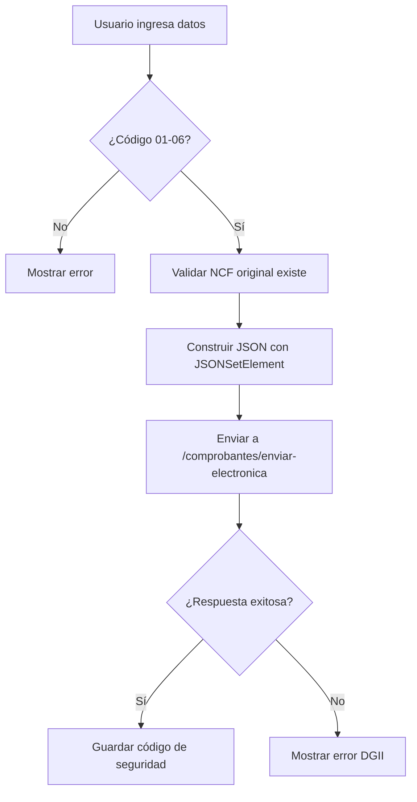

# 📋 Códigos de Modificación para Notas de Débito (Tipo 33)

## 🎯 **¿Qué es el Código de Modificación?**

El **Código de Modificación** es un campo **OBLIGATORIO** en las Notas de Débito (Tipo 33) que indica **por qué se está aumentando el monto** de una factura previamente emitida. Este código debe enviarse desde FileMaker en el campo `Facturas::CodigoModificacion`.

## 📊 **Códigos Disponibles para Tipo 33:**

| Código | Descripción                               | Casos de Uso Típicos                               | Ejemplo Práctico                                                |
| ------ | ----------------------------------------- | -------------------------------------------------- | --------------------------------------------------------------- |
| **01** | Intereses por mora                        | Cobro de intereses por pago tardío                 | Cliente pagó después de fecha límite, se cobran intereses       |
| **02** | Costos de cobros de documentos            | Gastos administrativos de cobranza                 | Gastos por gestión de cobranza de facturas vencidas             |
| **03** | Gastos de transporte                      | Cargos adicionales de envío o transporte           | Envío urgente de resultados de laboratorio                      |
| **04** | Bonificaciones y rebajas concedidas       | Ajuste de bonificaciones aplicadas incorrectamente | Se aplicó descuento que no correspondía                         |
| **05** | **Referencia a Factura de Consumo (E32)** | ⚠️ **SOLO para modificar NCF tipo 32 (Consumo)**   | Cargo adicional a una factura de consumo (tipo 32)              |
| **06** | Otras causas                              | Servicios adicionales o cargos no categorizados    | Recargos por urgencia, insumos extra, servicios complementarios |

## ⚠️ **ADVERTENCIA IMPORTANTE: Código 05**

El código **05** es **MUY ESPECÍFICO** y solo debe usarse cuando:

- Estás creando una **Nota de Débito tipo 33**
- Para modificar una **Factura de Consumo tipo 32**

**❌ NO usar código 05 para:**

- Modificar facturas tipo 31 (Crédito Fiscal)
- Modificar facturas tipo 34 (Nota de Crédito)
- Cargos adicionales generales → Usar código **06** en su lugar

**✅ Para "otros cargos adicionales" en facturas tipo 31, usa código 06**

---

## ✅ **Validaciones del Backend:**

Tu backend **NO valida el código específico** (puede ser "01" a "06"), solo valida que:

1. ✅ El campo `CodigoModificacion` **no esté vacío**
2. ✅ Sea enviado como **string** (no número)
3. ✅ Esté presente en la sección `modificacion`

⚠️ **La DGII sí valida** que el código sea apropiado para el tipo de NCF que estás modificando.

### **⚠️ Formato correcto desde FileMaker:**

```javascript
// ✅ CORRECTO - Enviar como string con 2 dígitos
Set Variable [ $json ; Value: JSONSetElement ( $json ; "modificacion.CodigoModificacion" ; "01" ; JSONString ) ]

// ✅ CORRECTO - Si viene con ceros iniciales
Set Variable [ $json ; Value: JSONSetElement ( $json ; "modificacion.CodigoModificacion" ; "03" ; JSONString ) ]

// ❌ INCORRECTO - Enviar como número
Set Variable [ $json ; Value: JSONSetElement ( $json ; "modificacion.CodigoModificacion" ; 1 ; JSONNumber ) ]
```

## 🔧 **Comportamiento del Backend:**

```javascript
// Tu backend REMUEVE ceros iniciales automáticamente:
"01" → se envía como "1" a TheFactoryHKA
"03" → se envía como "3" a TheFactoryHKA
"06" → se envía como "6" a TheFactoryHKA

// Código en controllers/comprobantes.js línea 1136:
codigoModificacion: modificacion.CodigoModificacion?.replace(/^0+/, '') || modificacion.CodigoModificacion
```

## 📋 **Ejemplos Completos por Código:**

### **Código 01 - Texto Incorrecto**

**Escenario:** Se facturó "Consulta médica" pero era "Consulta de especialidad"

```json
{
  "factura": {
    "ncf": "E330000000001",
    "tipo": "33",
    "total": "2000.00"
  },
  "items": [
    {
      "nombre": "Diferencia por consulta de especialidad",
      "precio": "2000.00"
    }
  ],
  "modificacion": {
    "CodigoModificacion": "01",
    "NCFModificado": "E310000000098",
    "FechaNCFModificado": "10-09-2025",
    "RazonModificacion": "Corrección: Se facturó consulta general pero fue consulta de especialidad"
  }
}
```

### **Código 02 - Valor Incorrecto**

**Escenario:** Se facturó RD$5,000 por error, debió ser RD$8,000

```json
{
  "factura": {
    "ncf": "E330000000002",
    "tipo": "33",
    "total": "3000.00"
  },
  "items": [
    {
      "nombre": "Ajuste por diferencia de precio",
      "precio": "3000.00"
    }
  ],
  "modificacion": {
    "CodigoModificacion": "02",
    "NCFModificado": "E310000000099",
    "FechaNCFModificado": "12-09-2025",
    "RazonModificacion": "Se facturó RD$5,000 por error, el monto correcto es RD$8,000. Diferencia a cobrar: RD$3,000"
  }
}
```

### **Código 03 - Fecha Incorrecta**

**Escenario:** Servicio en día festivo con tarifa especial no aplicada

```json
{
  "factura": {
    "ncf": "E330000000003",
    "tipo": "33",
    "total": "1500.00"
  },
  "items": [
    {
      "nombre": "Recargo por tarifa de día festivo",
      "precio": "1500.00"
    }
  ],
  "modificacion": {
    "CodigoModificacion": "03",
    "NCFModificado": "E310000000100",
    "FechaNCFModificado": "01-01-2025",
    "RazonModificacion": "Servicio realizado en día festivo (01-01-2025), se aplicó tarifa regular por error. Recargo correspondiente."
  }
}
```

### **Código 04 - Referencia a Otros Documentos**

**Escenario:** Cargos por estudios complementarios ordenados posteriormente

```json
{
  "factura": {
    "ncf": "E330000000004",
    "tipo": "33",
    "total": "15000.00"
  },
  "items": [
    {
      "nombre": "Estudios complementarios según orden médica OM-2025-0145",
      "precio": "15000.00"
    }
  ],
  "modificacion": {
    "CodigoModificacion": "04",
    "NCFModificado": "E310000000101",
    "FechaNCFModificado": "05-09-2025",
    "RazonModificacion": "Cargos adicionales según orden médica complementaria OM-2025-0145 emitida el 06-09-2025"
  }
}
```

### **Código 05 - Referencia a Factura de Consumo (E32)**

**⚠️ ESCENARIO ESPECÍFICO:** Cargo adicional a una **Factura de Consumo tipo 32**

```json
{
  "factura": {
    "ncf": "E330000000005",
    "tipo": "33",
    "total": "500.00"
  },
  "items": [
    {
      "nombre": "Cargo adicional por servicio complementario",
      "precio": "500.00"
    }
  ],
  "modificacion": {
    "CodigoModificacion": "05",
    "NCFModificado": "E320000000015", // ⚠️ IMPORTANTE: NCF tipo 32 (Consumo)
    "FechaNCFModificado": "08-09-2025",
    "RazonModificacion": "Cargo adicional a factura de consumo por servicio complementario"
  }
}
```

**⚠️ IMPORTANTE:** Este código SOLO es válido cuando el `NCFModificado` es tipo **E32** (Factura de Consumo).

**❌ NO usar código 05 si estás modificando:**

- NCF tipo E31 (Factura de Crédito Fiscal) → Usar código **06**
- NCF tipo E33 (Nota de Débito) → Usar código **06**
- NCF tipo E34 (Nota de Crédito) → N/A (tipo 34 tiene sus propios códigos)

### **Código 06 - Otras Causas (Más Común para Cargos Adicionales)**

**Escenario 1:** Servicios adicionales no categorizados ✅ **RECOMENDADO PARA CARGOS GENERALES**

```json
{
  "factura": {
    "ncf": "E330000000006",
    "tipo": "33",
    "total": "8500.00"
  },
  "items": [
    {
      "nombre": "Recargo por atención fuera de horario",
      "precio": "3000.00"
    },
    {
      "nombre": "Insumos médicos especiales",
      "precio": "4500.00"
    },
    {
      "nombre": "Procesamiento urgente",
      "precio": "1000.00"
    }
  ],
  "modificacion": {
    "CodigoModificacion": "06", // ✅ Usar para cargos adicionales generales
    "NCFModificado": "E310000000103",
    "FechaNCFModificado": "10-09-2025",
    "RazonModificacion": "Cargos adicionales: atención fuera de horario, insumos especiales y procesamiento urgente"
  }
}
```

**Escenario 2:** Ajuste de precio o tarifa

```json
{
  "factura": {
    "ncf": "E330000000007",
    "tipo": "33",
    "total": "2500.00"
  },
  "items": [
    {
      "nombre": "Ajuste por actualización de tarifa",
      "precio": "2500.00"
    }
  ],
  "modificacion": {
    "CodigoModificacion": "06",
    "NCFModificado": "E310000000104",
    "FechaNCFModificado": "12-09-2025",
    "RazonModificacion": "Ajuste de tarifa según resolución No. 2025-045 vigente desde el 01-09-2025"
  }
}
```

**💡 TIP:** Código 06 es el "comodín" - Úsalo para cualquier cargo adicional que no encaje claramente en los códigos 01-04.

## 🏥 **Casos de Uso Específicos para Clínica:**

### **1. Servicios Adicionales No Incluidos (MÁS COMÚN):**

- **Código recomendado:** `05` - Otros cargos adicionales
- **Ejemplos:**
  - Estudios complementarios solicitados después
  - Insumos médicos especiales no incluidos originalmente
  - Medicamentos administrados durante procedimiento
  - Interconsultas con especialistas adicionales

### **2. Recargos por Urgencia/Horario:**

- **Código recomendado:** `05` - Otros cargos adicionales
- **Ejemplos:**
  - Atención fuera de horario regular
  - Procesamiento urgente de resultados
  - Servicios en días festivos
  - Atención de emergencia con recargo

### **3. Cargos por Órdenes Médicas Adicionales:**

- **Código recomendado:** `04` - Referencia a otros documentos
- **Ejemplos:**
  - Estudios ordenados posteriormente por el médico
  - Procedimientos complementarios según nueva orden
  - Referencias a órdenes médicas específicas

### **4. Corrección de Tarifas:**

- **Código recomendado:** `02` - Valor incorrecto o `06` - Ajuste de precio
- **Ejemplos:**
  - Se aplicó tarifa incorrecta (usar `02`)
  - Actualización de lista de precios (usar `06`)
  - Diferencia por tipo de aseguradora

### **5. Servicios Mal Clasificados:**

- **Código recomendado:** `01` - Texto incorrecto
- **Ejemplos:**
  - Se facturó consulta general pero fue especializada
  - Se describió como procedimiento simple pero fue complejo
  - Error en la descripción del servicio que afecta el precio

## 🔍 **Validaciones que Realiza Tu Backend:**

```javascript
// 1. Validar que existe el campo
if (!facturaAdaptada.codigoModificacion) {
  throw new Error("❌ Tipo 33 requiere 'codigoModificacion'");
}

// 2. Validar que existe la razón
if (!facturaAdaptada.razonModificacion) {
  throw new Error("❌ Tipo 33 requiere 'razonModificacion'");
}

// 3. Validar que existe el NCF modificado
if (!facturaAdaptada.ncfModificado) {
  throw new Error("❌ Tipo 33 requiere 'ncfModificado'");
}

// 4. Validar que existe la fecha del NCF modificado
if (!facturaAdaptada.fechaNCFModificado) {
  throw new Error("❌ Tipo 33 requiere 'fechaNCFModificado'");
}
```

## 📱 **Configuración en FileMaker:**

### **Campo en la Tabla:**

```
Facturas::CodigoModificacion (Text, 2 caracteres)
```

### **Lista de Valores Recomendada:**

```
01 - Texto incorrecto
02 - Valor incorrecto
03 - Fecha incorrecta
04 - Referencia a otros documentos
05 - Otros cargos adicionales ⭐ (MÁS COMÚN)
06 - Ajuste de precio
```

### **Script de Validación:**

```javascript
# Validar que el código esté en el rango correcto
If [ Facturas::CodigoModificacion < "01" or Facturas::CodigoModificacion > "06" ]
    Show Custom Dialog [ "Error" ; "Código de modificación debe estar entre 01 y 06" ]
    Exit Script [ Text Result: "Error" ]
End If
```

## ⚠️ **Notas Importantes:**

1. **📝 Razón de Modificación:** Debe ser **descriptiva y clara**, explicando exactamente por qué se genera el cargo adicional.

2. **📅 Fecha del NCF Modificado:** Debe coincidir **exactamente** con la fecha de emisión de la factura original (código DGII 634 si no coincide).

3. **💰 Monto:** El total de la Nota de Débito debe ser **solo el cargo adicional**, NO el total acumulado con la factura original.

4. **🔗 NCF Modificado:** Debe ser un NCF **válido y previamente emitido** (usualmente tipo 31 o 32).

## 🚀 **Flujo Completo desde FileMaker:**



## ✅ **Checklist antes de Enviar:**

- [ ] Código de modificación entre "01" y "06"
- [ ] NCF modificado existe y está aprobado
- [ ] Fecha del NCF modificado es correcta
- [ ] Razón de modificación es descriptiva (mínimo 10 caracteres)
- [ ] RNC del comprador es válido (tipo 33 NO permite consumidor final)
- [ ] Items describen claramente los cargos adicionales
- [ ] Total es SOLO el cargo adicional, no el acumulado

---

**Última actualización:** Octubre 2025  
**Versión API:** Compatible con TheFactoryHKA v2.0+
