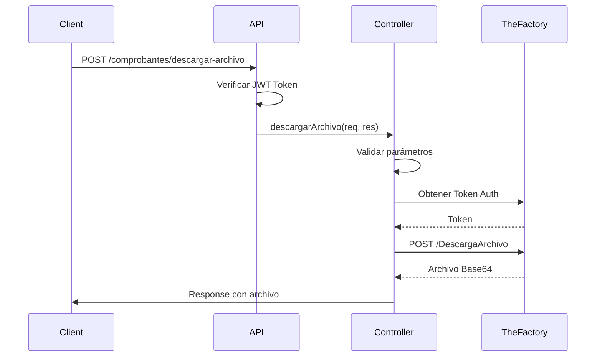

# Implementación del Endpoint de Descarga de Archivos

## Resumen de la Implementación

Se ha implementado exitosamente el endpoint `/comprobantes/descargar-archivo` que permite descargar archivos XML y PDF de documentos electrónicos desde la API de TheFactoryHKA.

## Fecha de Implementación

**13 de Octubre, 2025**

## Archivos Creados/Modificados

### Archivos Modificados

1. **`utils/constants.js`**

   - ✅ Agregada constante `THEFACTORY_DESCARGA_URL`
   - ✅ URL: `https://demoemision.thefactoryhka.com.do/api/DescargaArchivo`
   - ✅ Exportada en el módulo

2. **`controllers/comprobantes.js`**

   - ✅ Importada constante `THEFACTORY_DESCARGA_URL`
   - ✅ Agregada función `descargarArchivo`
   - ✅ Validaciones completas de parámetros
   - ✅ Manejo robusto de errores
   - ✅ Logging detallado
   - ✅ Exportada en el módulo

3. **`routes/comprobantes.js`**

   - ✅ Importado controlador `descargarArchivo`
   - ✅ Agregada ruta `POST /descargar-archivo`
   - ✅ Protegida con autenticación JWT

4. **`README.md`**
   - ✅ Actualizada lista de características
   - ✅ Agregado link a documentación
   - ✅ Agregado endpoint a la lista de API
   - ✅ Actualizado changelog con v2.2.0

### Archivos Creados

1. **`utils/ejemplo-descargar-archivo.json`**

   - ✅ Ejemplo completo de request/response
   - ✅ Documentación de parámetros
   - ✅ Ejemplos de códigos de error
   - ✅ Ejemplos de uso en diferentes lenguajes

2. **`utils/testDescargarArchivo.js`**

   - ✅ Script de prueba completo
   - ✅ Prueba de descarga XML
   - ✅ Prueba de descarga PDF
   - ✅ Pruebas de validación de parámetros
   - ✅ Guardado automático de archivos descargados
   - ✅ Logging detallado de resultados

3. **`docs/DESCARGAR_ARCHIVO_GUIA.md`**

   - ✅ Guía completa de uso del endpoint
   - ✅ Ejemplos en múltiples lenguajes (JavaScript, Python, cURL)
   - ✅ Documentación de parámetros y respuestas
   - ✅ Manejo de archivos Base64
   - ✅ Solución de problemas comunes
   - ✅ Flujo de trabajo completo

4. **`docs/IMPLEMENTACION_DESCARGAR_ARCHIVO.md`** (este archivo)
   - ✅ Resumen de la implementación
   - ✅ Lista de archivos modificados/creados
   - ✅ Instrucciones de uso y testing

## Características Implementadas

### ✅ Validaciones

- ✅ Validación de parámetro `rnc` (obligatorio)
- ✅ Validación de parámetro `documento` (obligatorio)
- ✅ Validación de parámetro `extension` (obligatorio)
- ✅ Validación de extensiones permitidas (`xml` o `pdf`)
- ✅ Autenticación JWT requerida

### ✅ Funcionalidad Principal

- ✅ Obtención automática de token de TheFactoryHKA
- ✅ Cache de token para mejor rendimiento
- ✅ Solicitud a API de TheFactoryHKA
- ✅ Descarga de archivos en Base64
- ✅ Manejo de respuestas exitosas
- ✅ Manejo de errores completo

### ✅ Manejo de Errores

- ✅ Parámetros faltantes (400)
- ✅ Extensión inválida (400)
- ✅ Documento no encontrado (400)
- ✅ Errores de autenticación (500)
- ✅ Timeout de conexión (408)
- ✅ Errores generales del servidor (500)

### ✅ Logging

- ✅ Log de parámetros recibidos
- ✅ Log de solicitud a TheFactoryHKA
- ✅ Log de respuesta recibida
- ✅ Log de errores detallados

### ✅ Documentación

- ✅ Comentarios JSDoc en el código
- ✅ Guía completa de usuario
- ✅ Ejemplos de uso en múltiples lenguajes
- ✅ Script de prueba funcional
- ✅ Ejemplos JSON
- ✅ README actualizado

## Estructura del Endpoint

### URL

```
POST /comprobantes/descargar-archivo
```

### Headers

```
Authorization: Bearer <JWT_TOKEN>
Content-Type: application/json
```

### Request Body

```json
{
  "rnc": "130960088",
  "documento": "E310000000033",
  "extension": "xml"
}
```

### Response (Exitoso)

```json
{
  "status": "success",
  "message": "Archivo descargado exitosamente",
  "data": {
    "archivo": "PEVDRiB4bWxuczp4c2k9Imh0dHA...",
    "extension": "xml",
    "documento": "E310000000033",
    "rnc": "130960088",
    "procesado": true,
    "codigo": 130,
    "mensaje": "Descarga exitosa"
  }
}
```

## Flujo de Trabajo



## Testing

### Ejecutar Pruebas

```bash
# Configurar token de autenticación
export TEST_AUTH_TOKEN="tu_token_jwt"

# Ejecutar script de prueba
node utils/testDescargarArchivo.js
```

### Pruebas Incluidas

1. ✅ Descarga de archivo XML
2. ✅ Descarga de archivo PDF (opcional)
3. ✅ Validación de parámetros faltantes
4. ✅ Validación de extensiones inválidas
5. ✅ Guardado automático de archivos

### Resultado Esperado

```
═══════════════════════════════════════════════════════
   TEST: DESCARGA DE ARCHIVOS - TheFactoryHKA
═══════════════════════════════════════════════════════

🧪 Iniciando prueba de descarga de archivo...

📋 Datos de prueba:
   RNC: 130960088
   Documento: E310000000033
   Extensión: xml

📤 Enviando solicitud a: http://localhost:3001/comprobantes/descargar-archivo

✅ Respuesta exitosa recibida

📊 Detalles de la respuesta:
   Status: success
   Mensaje: Archivo descargado exitosamente
   Código: 130
   Procesado: true
   Extensión: xml

💾 Archivo guardado exitosamente:
   Ruta: /path/to/E310000000033.xml
   Tamaño: 12.45 KB

✅ Prueba completada exitosamente

═══════════════════════════════════════════════════════
   ✅ TODAS LAS PRUEBAS COMPLETADAS EXITOSAMENTE
═══════════════════════════════════════════════════════
```

## Integración con API de TheFactoryHKA

### URL Base

```
https://demoemision.thefactoryhka.com.do/api/DescargaArchivo
```

### Autenticación

- ✅ Usa el mismo sistema de autenticación que otros endpoints
- ✅ Cache de token compartido
- ✅ Renovación automática antes de expiración

### Request a TheFactoryHKA

```json
{
  "token": "eyJhbGciOiJIUzI1NiIsInR5cCI6IkpXVCJ9...",
  "rnc": "130960088",
  "documento": "E310000000033",
  "extension": "xml"
}
```

### Response de TheFactoryHKA

```json
{
  "archivo": "PEVDRiB4bWxuczp4c2k9Imh0dHA...",
  "procesado": true,
  "codigo": 130,
  "mensaje": "Descarga exitosa"
}
```

## Configuración Necesaria

### Variables de Entorno

Las siguientes variables ya deberían estar configuradas (usadas por otros endpoints):

```bash
THEFACTORY_USUARIO=your_username
THEFACTORY_CLAVE=your_password
THEFACTORY_RNC=your_rnc
```

### Dependencias

Todas las dependencias necesarias ya están instaladas:

- ✅ `axios` - Para llamadas HTTP a TheFactoryHKA
- ✅ `http-status` - Para códigos de estado HTTP
- ✅ JWT middleware - Para autenticación

## Uso en FileMaker

### Script FileMaker Básico

```javascript
# FileMaker Script para descargar archivo XML
Set Variable [ $token ; Value: /* Token JWT */ ]
Set Variable [ $rnc ; Value: "130960088" ]
Set Variable [ $documento ; Value: Factura::eNCF ]
Set Variable [ $extension ; Value: "xml" ]

Set Variable [ $url ; Value: "https://tu-servidor.com/comprobantes/descargar-archivo" ]

# Preparar request JSON
Set Variable [ $json ; Value:
  "{" &
  "\"rnc\":\"" & $rnc & "\"," &
  "\"documento\":\"" & $documento & "\"," &
  "\"extension\":\"" & $extension & "\"" &
  "}"
]

# Llamar a API
Insert from URL [
  Target: Factura::ArchivoXML_Base64 ;
  $url ;
  cURL options:
    "-H \"Authorization: Bearer " & $token & "\"" &
    "-H \"Content-Type: application/json\"" &
    "-d '" & $json & "'"
]

# Procesar respuesta
# El campo ArchivoXML_Base64 contendrá el JSON con el archivo en Base64
```

## Notas de Seguridad

- ✅ Endpoint protegido con autenticación JWT
- ✅ Validación estricta de parámetros
- ✅ Timeout configurado (30 segundos)
- ✅ No almacena archivos en el servidor
- ✅ Transmisión segura en Base64
- ✅ Logging de todas las operaciones

## Próximos Pasos Sugeridos

1. **Testing en Producción**

   - Probar con documentos reales
   - Verificar rendimiento con archivos grandes
   - Ajustar timeout si es necesario

2. **Monitoreo**

   - Configurar alertas para errores
   - Monitorear tiempo de respuesta
   - Tracking de uso del endpoint

3. **Optimizaciones Futuras**

   - Considerar compresión de archivos grandes
   - Implementar paginación si es necesario
   - Cache de archivos descargados frecuentemente

4. **Integración**
   - Integrar con FileMaker
   - Crear UI para descarga en frontend
   - Automatizar descarga post-envío

## Documentos de Referencia

- [Documentación API TheFactoryHKA](https://felwiki.thefactoryhka.com.do/doku.php?id=restapidescargaarchivo)
- [Guía de Usuario](./DESCARGAR_ARCHIVO_GUIA.md)
- [Ejemplo JSON](../utils/ejemplo-descargar-archivo.json)
- [Script de Prueba](../utils/testDescargarArchivo.js)

## Soporte

Para preguntas o problemas:

1. Revisar [DESCARGAR_ARCHIVO_GUIA.md](./DESCARGAR_ARCHIVO_GUIA.md)
2. Ejecutar script de prueba para debugging
3. Revisar logs del servidor
4. Contactar soporte técnico

## Conclusión

✅ El endpoint de descarga de archivos ha sido implementado exitosamente con:

- Validaciones completas
- Manejo robusto de errores
- Documentación exhaustiva
- Scripts de prueba funcionales
- Integración perfecta con sistema existente

El endpoint está listo para uso en producción.
